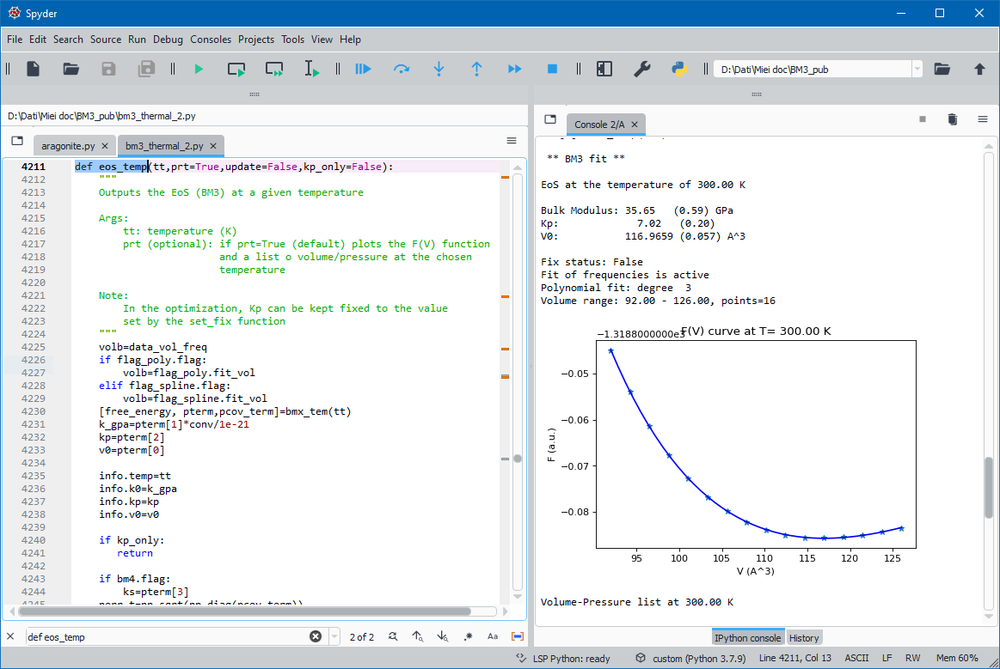

.. BM3-thermal documentation master file, created by
   sphinx-quickstart on Wed Mar  3 15:32:59 2021.
   You can adapt this file completely to your liking, but it should at least
   contain the root `toctree` directive.

Welcome to QM-Thermodynamics's documentation!
=============================================

Ab initio calculation of an equation of state and thermodynamics of minerals
----------------------------------------------------------------------------

Thermodynamic properties, equation of state (3th or 4th-order Birch-Murnaghan EoS) and thermal expansion 
of crystal phases can be computed, along with their temperature and pressure dependence, 
by using the code here described, starting from data calculated at the *ab initio* quantum-mechanical (QM) level, 
which are essentially *static* energies (*internal energies*) and vibrational frequencies as functions of the 
unit cell volume.

*Ab initio* data are processed within the general framework of *Statistical Thermodynamics*, within the
limit of the *quasi-harmonic approximation* (QHA). 

Equilibria between mineral species (only end-members can be considered) can be evaluated starting from 
thermodynamic data computed at the QM level. Such QM data concern the bulk modulus, its pressure derivative and its 
thermal dependence; the thermal expansion and the specific heat (at constant pressure) and their temperature 
dependences; the entropy at the reference state (T=298.15K, P=1 bar). 

Thermodynamic QM data can then be used to evaluate the Gibbs free energy at any temperature and pressure, 
by following algorithms equivalent to those implemented in the `Perplex package <https://https://www.perplex.ethz.ch/> `.

All of the properties are computed by constructing the Helmholtz free energy [F(V,T)] as a function of volume
(V) and temperature (T). At any given T, F is fitted in a V range by a 3^order volume-integrated Birch-Murnaghan
EoS (V-BM3). Results of the fitting are then used to compute all the possibles properties derivable from F.

The program can be loaded and run in a normal Python console as well as in any other environment like 
`Spyder <https://www.spyder-ide.org>`_  

`Jupyter Notebooks <https://jupyter.org/>`_ or Jupyter Labs are convenient environments, too. 
 
Other than the local PC, Jupyter Notebooks can also be viewed by using the `viewer <https://nbviewer.jupyter.org/>`_
by inserting the location of the book; see the example 
`here <https://nbviewer.jupyter.org/github/Mauro-Prencipe/BMx-QM/blob/master/basic_eos_tutorial.ipynb>`_ .

Once the notebook has been loaded in nbviewer, by clicking on the **Execute on Binder** button an *image* is created 
on the `Binder site <https://gke.mybinder.org/>`_ and the notebook is executed (though it may require some minutes to 
build the image and run it on the server).

.. toctree::
   :maxdepth: 3
   :caption: Table of Contents
   :name: mastertoc

   files
   required_files
   Main_features
   EOS_tutorial
   Update

* :ref:`genindex`
* :ref:`search`
