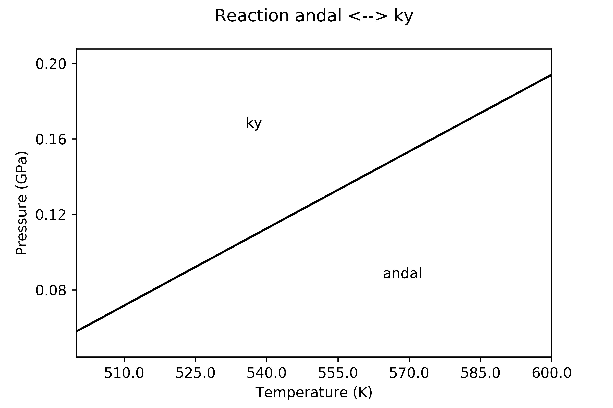

.. BM3-thermal documentation master file, created by
   sphinx-quickstart on Wed Mar  3 15:32:59 2021.
   You can adapt this file completely to your liking, but it should at least
   contain the root `toctree` directive.

Welcome to QM-Thermodynamics's documentation!
=============================================

Ab initio calculation of an equation of state and thermodynamics of minerals
----------------------------------------------------------------------------

Thermodynamic properties, equation of state (3th or 4th-order Birch-Murnaghan EoS) and thermal expansion 
of crystal phases can be computed, along with their temperature and pressure dependence, 
by using the code here described, starting from data calculated at the *ab initio* quantum-mechanical (QM) level, 
which are essentially *static* energies (*internal energies*) and vibrational frequencies as functions of the 
unit cell volume.

*Ab initio* data are processed within the general framework of *Statistical Thermodynamics*, within the
limit of the *quasi-harmonic approximation* (QHA). 

Properties like:
 
- bulk modulus, its pressure derivative and its thermal dependence; 
- thermal expansion and its temperature dependence; 
- specific heat (at constant pressure) and its temperature dependences; 
- entropy at the reference state (T=298.15K, P=1 bar)

can be computed from QM data, and can then be used to evaluate the Gibbs free energy at any temperature and pressure, 
by following algorithms equivalent to those implemented in the `Perplex package <https://www.perplex.ethz.ch/>`_ .

Equilibria between mineral species (only end-members can be considered) can be evaluated starting from 
the thermodynamic data thus derived. Here is an example where the equilibrium between kyanite and andalusite has 
been determined in a *P/T* field: thermodynamics data for kyanite are computed at the QM level, whereas 
those for andalusite are from literature 
(`Holland & Powell <https://onlinelibrary.wiley.com/doi/abs/10.1111/j.1525-1314.1998.00140.x>`_ )

All of the properties are computed by constructing the Helmholtz free energy [F(V,T)] as a function of volume
(V) and temperature (T). At any given T, F is fitted in a V range by a 3^order volume-integrated Birch-Murnaghan
EoS (V-BM3). Results of the fitting are then used to compute all the possibles properties derivable from F.

The program can be loaded and run in a normal Python console as well as in any other environment like 
`Spyder <https://www.spyder-ide.org>`_  

.. image:: _images/spyderimage.svg
   :scale: 80 %

`Jupyter Notebooks <https://jupyter.org/>`_ or Jupyter Labs are convenient environments, too. 
 
Other than the local PC, Jupyter Notebooks can also be viewed by using the `viewer <https://nbviewer.jupyter.org/>`_
by inserting the location of the book; see the example 
`here <https://nbviewer.jupyter.org/github/Mauro-Prencipe/QM-thermodynamics/blob/main/basic_eos_tutorial.ipynb>`_ .

Once the notebook has been loaded in nbviewer, by clicking on the **Execute on Binder** button an *image* is created 
on the `Binder site <https://gke.mybinder.org/>`_ and the notebook is executed (though it may require some minutes to 
build the image and run it on the server).

Information about the input required to run the program can be found in the `EoS tutorial <_static/basic_eos_tutorial.html>`_ , as well as 
in the sections `Input file <https://qm-thermodynamics.readthedocs.io/en/main/files.html>`_ and 
`required files <https://qm-thermodynamics.readthedocs.io/en/main/required_files.html>`_ on this site. 

The github repository of the package can be found `here <https://github.com/Mauro-Prencipe/QM-thermodynamics>`_ .

The input files used in the `EoS tutorial <_static/basic_eos_tutorial.html>`_ refer to the example on *pyrope* and can be found on 
`Github <https://github.com/Mauro-Prencipe/QM-thermodynamics/tree/main/pyrope>`_ . The notebook of such tutorial can also be view 
`here <https://nbviewer.jupyter.org/github/Mauro-Prencipe/QM-thermodynamics/blob/main/basic_eos_tutorial.ipynb>`_ , on the nbviewer
site and, from there, compiled and interactively used on Binder (click on the *Execute on Binder* icon).

.. toctree::
   :maxdepth: 3
   :caption: Input description
   :name: mastertoc

   files
   required_files
   Main_features
   EOS_tutorial
   Update
   
.. toctree::
   :maxdepth: 3
   :caption: Contact and citation 
   
   Version
   Citation
   Contact
   
.. toctree::
   :maxdepth: 3
   :caption: Download
   
   download
   
.. image:: https://zenodo.org/badge/DOI/10.5281/zenodo.6821531.svg
   :target: https://doi.org/10.5281/zenodo.6821531

* :ref:`genindex`
* :ref:`search`
